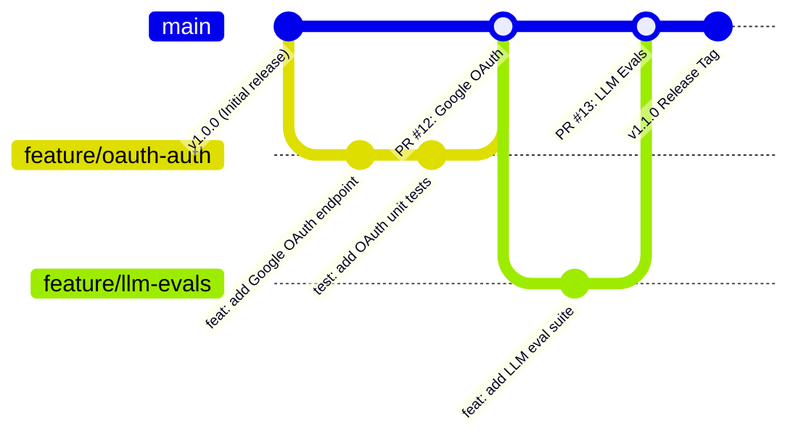
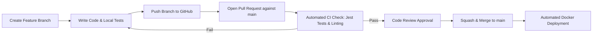

# SupportPilot — Git Workflow & Branching Strategy

This document outlines the standard Git version control workflow, commit conventions, branching model, pull request reviews, and release tagging implemented in SupportPilot.

---

## 1. Branching Strategy (Trunk-Based / Feature Branch Model)

SupportPilot follows a **Feature Branch Workflow** centered around a stable `main` production branch.



### Branch Naming Rules
- `main`: Protected production branch. All merged code must pass automated CI/CD unit and integration test suites.
- `feature/<feature-name>`: New feature implementations (e.g., `feature/oauth-auth`, `feature/rag-chunks`).
- `bugfix/<issue-name>`: Bug fixes for reported issues (e.g., `bugfix/rate-limit-redis`).
- `docs/<doc-name>`: Documentation additions and architectural updates (e.g., `docs/git-workflow`).
- `hotfix/<critical-fix>`: Urgent production hotfixes branched directly from `main`.

---

## 2. Conventional Commit Specifications

All commits must follow the **Conventional Commits 1.0.0** specification:

$$\text{Format}: \quad \texttt{<type>(<scope>): <short summary>}$$

### Allowed Commit Types
| Type | Purpose | Example |
| :--- | :--- | :--- |
| `feat` | New user-facing feature or API endpoint | `feat(auth): add Google OAuth 2.0 login handler` |
| `fix` | Bug fix in backend or frontend | `fix(rate-limit): fix Redis sliding window key expiration` |
| `docs` | Documentation changes only | `docs(readme): add Git workflow specification` |
| `test` | Adding or updating Jest / Supertest cases | `test(api): add RBAC forbidden endpoint integration tests` |
| `refactor` | Code refactoring without behavioral changes | `refactor(agent): modularize prompt template builder` |
| `chore` | Dependency updates, config tweaks, Docker changes | `chore(deps): upgrade @google/genai package` |

---

## 3. Pull Request & Review Lifecycle



### PR Requirements
1. **Passing Automated Tests**: Running `npm test` inside `backend/` must achieve 100% pass rate.
2. **No Secret Leaks**: `.env` files must remain strictly un-tracked via `.gitignore`.
3. **Single Responsibility**: Each PR should address a single feature or bug fix.

---

## 4. Useful Git Command Reference

### Feature Development Steps
```bash
# 1. Ensure local main is up to date
git checkout main
git pull origin main

# 2. Create a new feature branch
git checkout -b feature/oauth-auth

# 3. Stage and commit changes using Conventional Commits
git add .
git commit -m "feat(auth): implement Google OAuth 3rd-party authentication"

# 4. Push feature branch to GitHub
git push -u origin feature/oauth-auth
```

### Rebasing & Syncing
```bash
# Rebase feature branch onto latest main before merging
git fetch origin
git rebase origin/main
```

### Tagging Releases
```bash
# Tag production releases
git tag -a v1.2.0 -m "Release v1.2.0: OAuth, RBAC, and LLM API Integration"
git push origin v1.2.0
```
