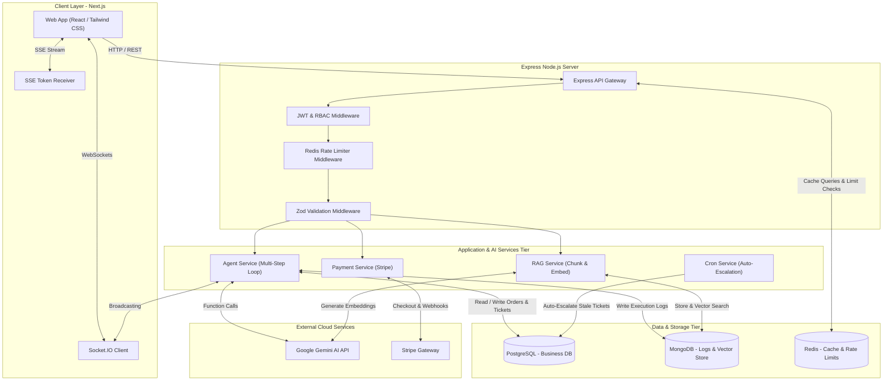
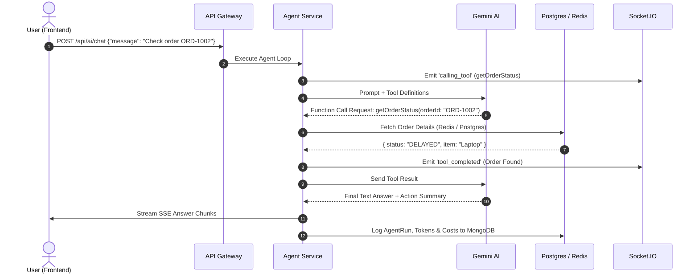
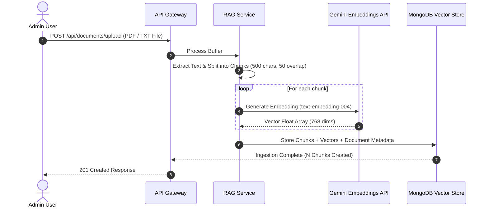

# SupportPilot — High-Level Design (HLD) Document

## 1. System Overview & Objectives
**SupportPilot** is an enterprise-grade, multi-tenant AI-assisted customer support platform designed to automate tier-1 support queries, handle multi-step order investigations, ingest knowledge base documents using Retrieval-Augmented Generation (RAG), and seamlessly escalate unresolved issues to human agents via tickets.

### Core Architecture Pillars
- **Autonomous Multi-Step AI Agent**: Uses Google Gemini function calling to run multi-tool execution loops (checking order statuses, searching knowledge bases, auto-generating support tickets).
- **Hybrid Polyglot Data Layer**: Combines PostgreSQL (ACID-compliant business domain models) with MongoDB (high-throughput unstructured logs & vector embeddings) and Redis (volatile caching & rate-limiting).
- **Real-Time Communication**: Integrates Server-Sent Events (SSE) for token streaming and Socket.IO for live step-by-step agent execution updates.
- **Enterprise Security & Defense**: Features JWT authentication, Role-Based Access Control (RBAC), Redis rate-limiting, prompt injection directives, and payload sanitization.

---

## 2. High-Level System Architecture Diagram

---

## 3. Subsystem Breakdown

### 3.1 Presentation Tier (Frontend Client)
- **Framework**: Next.js (App Router, Server Components & Client SPA).
- **State & Hooks**: React `useState`, `useEffect`, dynamic tab composition (`ChatPanel`, `TicketsView`, `KnowledgeBase`, `AnalyticsDashboard`).
- **Communication Protocols**: 
  - REST API calls (`fetch`) for CRUD operations.
  - Server-Sent Events (SSE) for continuous AI response streaming.
  - WebSockets (Socket.IO client) for real-time tool execution progress indicators.

### 3.2 Gateway & Middleware Tier (Express API)
- **API Router**: Exposes structured endpoints under `/api/auth`, `/api/orders`, `/api/tickets`, `/api/documents`, `/api/ai`, `/api/admin`, `/api/payments`.
- **Security Chain**:
  1. `authenticateJWT`: Validates Bearer tokens and injects authenticated user scope.
  2. `authorizeRoles`: Restricts administrative routes to `ADMIN` scope.
  3. `rateLimitMiddleware`: Uses Redis sliding-window counters to block abusive requests.
  4. `validateRequest`: Ensures payload integrity via Zod schemas.

### 3.3 Application & AI Business Services
- **Agent Execution Engine** ([`agent.service.ts`](file:///c:/Users/sohin/.gemini/antigravity/scratch/support-pilot/backend/src/services/agent.service.ts)): Controls tool declaration, system prompt enforcement, multi-step agent reasoning loops, token usage logging, and cost accounting.
- **RAG Processing Engine** ([`rag.service.ts`](file:///c:/Users/sohin/.gemini/antigravity/scratch/support-pilot/backend/src/services/rag.service.ts)): Handles document ingestion, text chunking with overlap, vector embedding creation, and Cosine Similarity vector retrieval.
- **Background Cron Engine** ([`cron.ts`](file:///c:/Users/sohin/.gemini/antigravity/scratch/support-pilot/backend/src/jobs/cron.ts)): Schedules automated tasks (escalating tickets pending over 24h, generating daily metric snapshots).

### 3.4 Data Storage Tier (Polyglot Architecture)
- **PostgreSQL (Prisma ORM)**: Manages relational, strictly normalized entities (`User`, `Order`, `Ticket`, `TicketComment`, `Subscription`).
- **MongoDB (Mongoose)**: Manages unstructured document chunks (`DocumentChunk`), execution traces (`AgentRun`), and audit logs (`SystemLog`).
- **Redis (ioredis)**: Provides ultra-fast volatile key-value caching for customer order lookup queries and sliding-window rate limit counters.

---

## 4. End-to-End Key User Flows

### 4.1 Multi-Step AI Agent Query & Tool Execution

### 4.2 Document Ingestion & RAG Vector Storage

---

## 5. Non-Functional Requirements & Security Architecture

### 5.1 Security Controls
- **Prompt Injection Defense**: System prompts explicitly direct Gemini to isolate retrieved RAG text as information-only data, refusing execution of injected prompt instructions inside uploaded documents.
- **User Scope Isolation**: Function calls (`getOrderStatus`, `cancelOrder`) extract user IDs directly from verified JWT tokens, preventing parametric tampering.
- **Password Security**: Passwords are hashed using `bcryptjs` with salt factor 10 before insertion.

### 5.2 Scalability & Performance
- **Caching Layer**: Frequent order queries are cached in Redis for 300 seconds, reducing database load by up to 80%.
- **Stateless API Gateway**: Express API instances maintain no local session state, allowing horizontal auto-scaling behind load balancers.
- **Containerization**: Full stack encapsulated via Docker & Docker Compose (`Postgres`, `Mongo`, `Redis`, `Backend`, `Frontend`).
