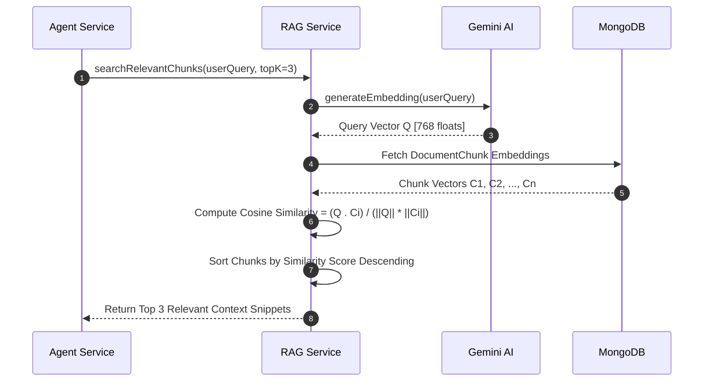

# SupportPilot — Low-Level Design (LLD) Document

## 1. Data Models & Entity Relationship Diagrams (ERD)

### 1.1 PostgreSQL Relational Database Schema (Prisma ORM)

```mermaid
erDiagram
    USER ||--o{ ORDER : places
    USER ||--o{ TICKET : submits
    USER ||--o| SUBSCRIPTION : has
    TICKET ||--o{ TICKET_COMMENT : contains

    USER {
        string id PK "UUID"
        string email UK "Indexed"
        string password
        string name
        enum role "CUSTOMER | ADMIN"
        datetime createdAt
    }

    ORDER {
        string id PK "UUID"
        string userId FK "Indexed"
        string orderNumber UK "Indexed"
        float totalAmount
        enum status "PENDING | SHIPPED | DELIVERED | DELAYED | CANCELLED"
        datetime createdAt
    }

    TICKET {
        string id PK "UUID"
        string userId FK "Indexed"
        string ticketNumber UK
        string subject
        string description
        enum priority "LOW | MEDIUM | HIGH | URGENT"
        enum status "OPEN | IN_PROGRESS | RESOLVED | ESCALATED | CLOSED"
        datetime createdAt
    }

    TICKET_COMMENT {
        string id PK "UUID"
        string ticketId FK "Indexed"
        string authorName
        string message
        boolean isInternal
        datetime createdAt
    }

    SUBSCRIPTION {
        string id PK "UUID"
        string customerId FK UK
        enum tier "FREE | PRO | ENTERPRISE"
        enum status "ACTIVE | INACTIVE | CANCELLED"
        datetime createdAt
    }
```

### 1.2 MongoDB Unstructured & Vector Schemas (Mongoose)

#### Collection: `AgentRun`
```typescript
interface IAgentRun {
  _id: Types.ObjectId;
  runId: string; // Unique index
  userId: string; // Indexed
  conversationId: string; // Indexed
  userQuery: string;
  intentDetected: string;
  toolsCalled: Array<{
    toolName: string;
    args: Record<string, any>;
    result: Record<string, any>;
    timestamp: Date;
  }>;
  finalAnswer: string;
  inputTokens: number;
  outputTokens: number;
  estimatedCostUsd: number;
  latencyMs: number;
  createdAt: Date;
}
```

#### Collection: `DocumentChunk`
```typescript
interface IDocumentChunk {
  _id: Types.ObjectId;
  documentId: string; // Indexed
  fileName: string;
  chunkIndex: number;
  textContent: string;
  embedding: number[]; // 768-dimensional float array
  createdAt: Date;
}
```

---

## 2. Component Class Interfaces & Core Logic

### 2.1 Agent Engine (`AgentService`)
- **File**: [`agent.service.ts`](file:///c:/Users/sohin/.gemini/antigravity/scratch/support-pilot/backend/src/services/agent.service.ts)

```typescript
export interface AgentResponse {
  intent: string;
  answer: string;
  sources: string[];
  confidence: number;
  actionTaken?: string;
  runId: string;
}

export class AgentService {
  /** Declares executable tools for Gemini model */
  private tools: FunctionDeclaration[];

  /** Executes multi-step agent tool evaluation loop */
  public async executeAgentLoop(
    userQuery: string,
    userId: string,
    conversationId: string
  ): Promise<AgentResponse>;

  /** Calculates input/output token usage & estimated USD cost */
  private computeRunCost(inputTokens: number, outputTokens: number): number;
}
```

### 2.2 RAG Vector Search Engine (`RAGService`)
- **File**: [`rag.service.ts`](file:///c:/Users/sohin/.gemini/antigravity/scratch/support-pilot/backend/src/services/rag.service.ts)

```typescript
export class RAGService {
  /** Splits input text buffer into overlapping chunks */
  public chunkText(text: string, chunkSize = 500, overlap = 50): string[];

  /** Ingests document, embeds text chunks, and persists in MongoDB */
  public async processAndStoreDocument(
    documentId: string,
    fileName: string,
    fileBuffer: Buffer,
    mimeType: string
  ): Promise<number>;

  /** Computes Cosine Similarity between prompt vector and stored chunk vectors */
  public calculateCosineSimilarity(vecA: number[], vecB: number[]): number;

  /** Retrieves top K relevant text chunks for a query */
  public async searchRelevantChunks(query: string, topK = 3): Promise<DocumentChunk[]>;
}
```

---

## 3. Design Patterns Implementation Matrix

| Design Pattern | Location in Codebase | Purpose & Implementation |
| :--- | :--- | :--- |
| **Strategy & Factory Pattern** | [`agent.service.ts`](file:///c:/Users/sohin/.gemini/antigravity/scratch/support-pilot/backend/src/services/agent.service.ts#L43-L86) | Encapsulates tool declarations and routes tool execution requests dynamically based on function names. |
| **Middleware / Chain of Responsibility** | [`backend/src/middleware/`](file:///c:/Users/sohin/.gemini/antigravity/scratch/support-pilot/backend/src/middleware/) | Passes requests sequentially through Authentication $\rightarrow$ Role Authorization $\rightarrow$ Redis Rate Limiting $\rightarrow$ Schema Validation $\rightarrow$ Controller. |
| **Closure & State Encapsulation** | [`helpers.ts`](file:///c:/Users/sohin/.gemini/antigravity/scratch/support-pilot/backend/src/utils/helpers.ts#L15-L36) | `memoize()` higher-order function encapsulates internal cache Map state in an outer closure environment. |
| **Observer / Pub-Sub Pattern** | [`server.ts`](file:///c:/Users/sohin/.gemini/antigravity/scratch/support-pilot/backend/src/server.ts) & [`ai.ts`](file:///c:/Users/sohin/.gemini/antigravity/scratch/support-pilot/backend/src/routes/ai.ts) | Socket.IO WebSockets broadcast real-time agent execution events to connected subscribers. |
| **Singleton Pattern** | [`db.ts`](file:///c:/Users/sohin/.gemini/antigravity/scratch/support-pilot/backend/src/config/db.ts) | Manages single shared instances of `PrismaClient` and Mongoose connections. |

---

## 4. API Interface Specifications

### 4.1 AI Chat & Agent Invocation
- **Endpoint**: `POST /api/ai/chat`
- **Headers**: `Authorization: Bearer <JWT>`
- **Request Body**:
  ```json
  {
    "message": "My order ORD-1002 is delayed. Can you create a ticket?",
    "conversationId": "conv_9921a"
  }
  ```
- **Response Payload (SSE Stream & Structured JSON)**:
  ```json
  {
    "success": true,
    "data": {
      "intent": "ORDER_INVESTIGATION_AND_TICKET",
      "answer": "I found order ORD-1002 is currently delayed in transit. I have automatically created support ticket #TCK-8821 for our logistics team.",
      "sources": ["Order Management System"],
      "confidence": 0.98,
      "actionTaken": "CREATE_SUPPORT_TICKET",
      "runId": "run_881a7"
    }
  }
  ```

### 4.2 Document Ingestion
- **Endpoint**: `POST /api/documents/upload`
- **Headers**: `Authorization: Bearer <JWT>`, `Content-Type: multipart/form-data`
- **Roles Allowed**: `ADMIN`
- **Payload**: `file: <Binary PDF or TXT>`
- **Response**:
  ```json
  {
    "success": true,
    "data": {
      "documentId": "doc_3312",
      "fileName": "Shipping_Policy.pdf",
      "chunksCount": 14,
      "message": "Document successfully ingested and embedded."
    }
  }
  ```

---

## 5. Low-Level Sequence Diagrams

### 5.1 RAG Vector Retrieval Math Flow

