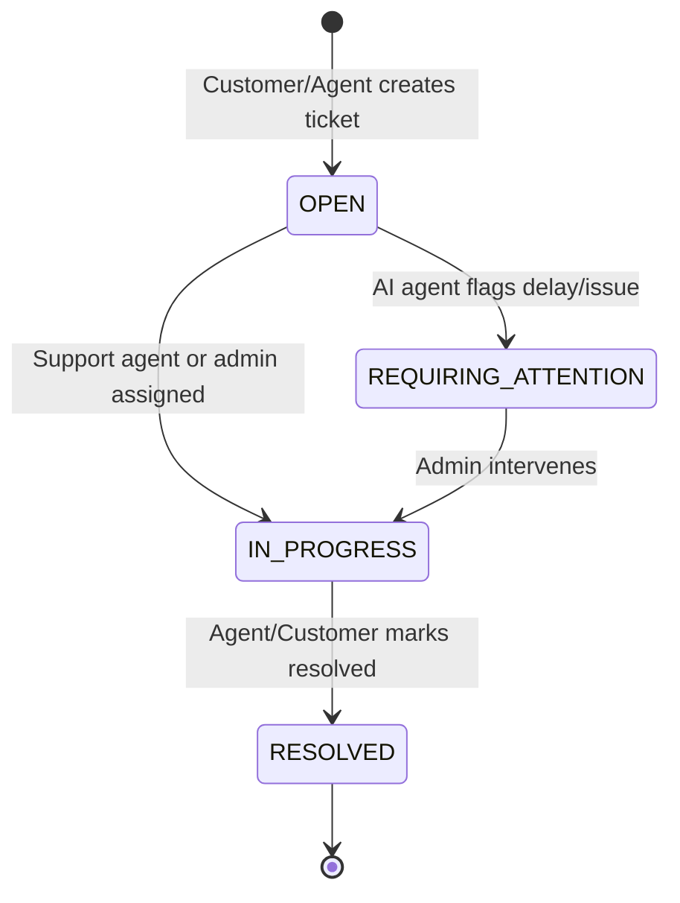
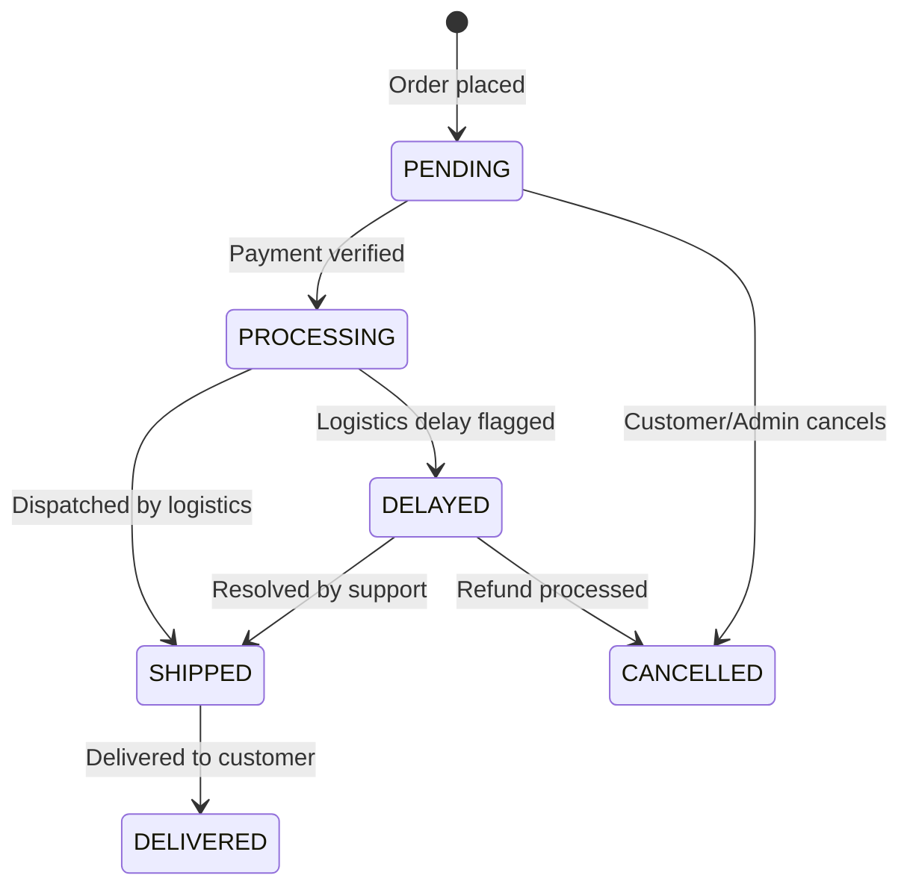
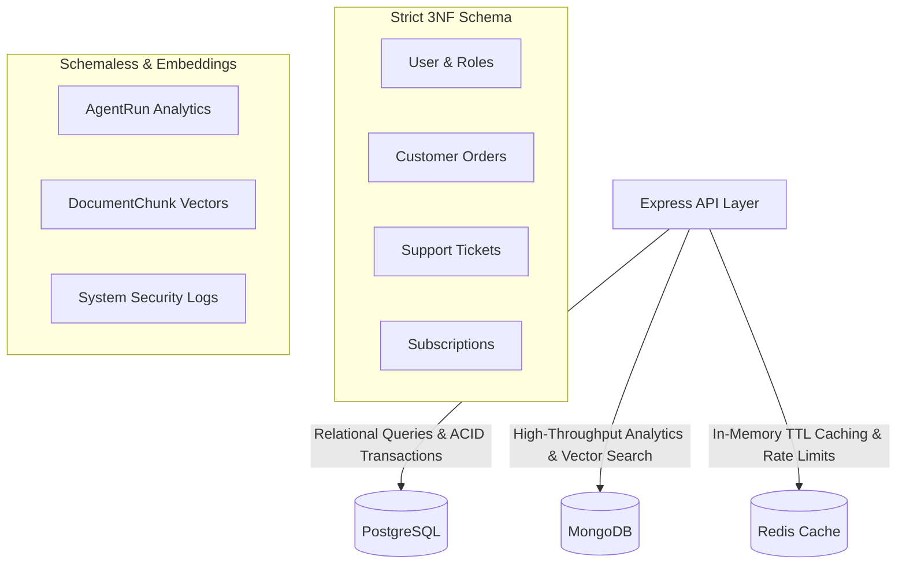

# SupportPilot — Problem Modeling & System Domain Analysis

This document details the problem modeling, domain-driven design (DDD), entity state transitions, and architectural trade-offs powering the SupportPilot platform.

---

## 1. Problem Statement & Domain Context
Enterprise customer support organizations face high operational costs and slow response latencies when manually processing tier-1 queries (order status lookups, invoice checks, return policy inquiries). 

### Core Requirements
1. **Automated Query Resolution**: Reduce tier-1 human support volume by up to 70% using autonomous AI agent execution.
2. **Multi-Step Problem Solving**: Investigate complex customer issues (e.g., checking order status, verifying shipping delays, auto-creating tickets).
3. **Contextual Knowledge Retrieval**: Search internal policies via Retrieval-Augmented Generation (RAG).
4. **Graceful Escalation**: Seamlessly transfer unresolved or high-urgency queries to human agents via support tickets.

---

## 2. Domain Entities & State Machines

### 2.1 Ticket Lifecycle State Machine

### 2.2 Order Fulfillment State Machine

---

## 3. Polyglot Persistence & Data Modeling Trade-Offs

SupportPilot adopts a **Polyglot Persistence Strategy**, selecting database engines based on query workload characteristics:

### Architectural Trade-Off Analysis
| Requirement | Selected Database | Architectural Rationale |
| :--- | :--- | :--- |
| **Financial & User Records** | **PostgreSQL** | Requires strict ACID transactions (`prisma.$transaction`), Foreign Key constraints, and 3NF normalization. |
| **RAG Vector Search** | **MongoDB** | Stores high-dimensional 768-float vectors alongside text chunks; supports dynamic aggregation pipelines (`$group`, `$sort`). |
| **Order Search Caching** | **Redis** | In-memory key-value store with TTL (300s) to absorb peak order lookup traffic and prevent DB exhaustion. |

---

## 4. Problem Modeling Metrics & Performance Indicators

1. **Automation Resolution Rate (ARR)**: Percentage of customer queries fully resolved by SupportPilot AI without human intervention.
2. **Mean Time to Resolution (MTTR)**: Reduction in average ticket lifecycle duration (target: $< 5$ minutes for automated cases).
3. **Cosine Vector Retrieval Precision**: Top-$K$ semantic search accuracy for ingested RAG knowledge documents.
